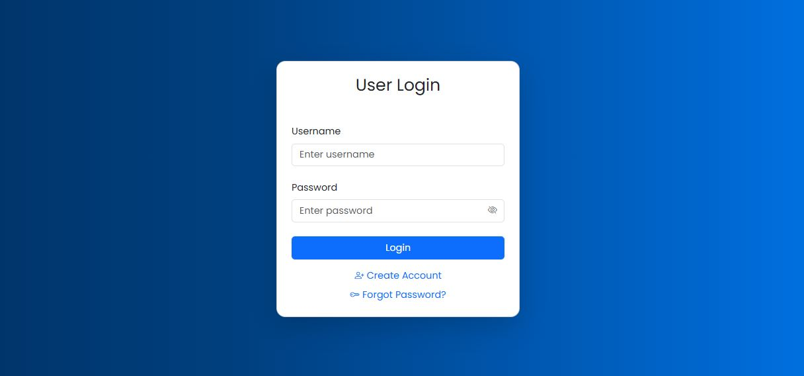
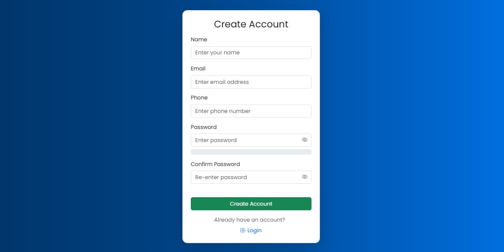
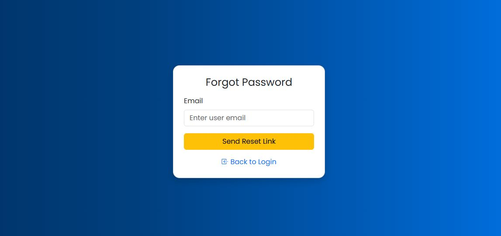
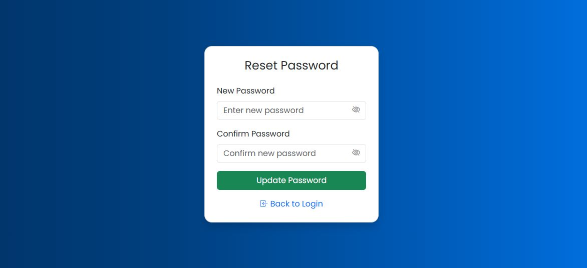
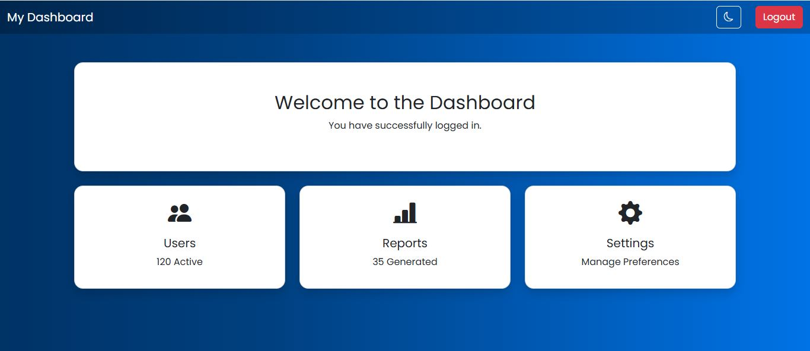
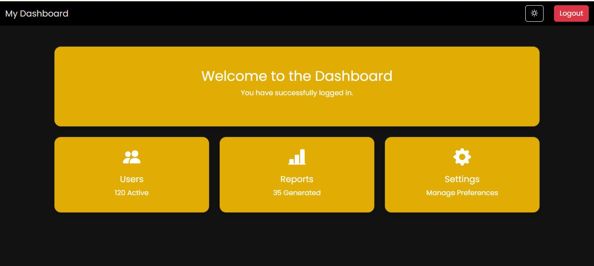

# 🔐 Authentication System with Bootstrap 5

## 📌 Project Description
This is a responsive authentication system built using HTML, Bootstrap 5, and custom CSS.  
It includes multiple pages for user authentication with modern UI design and interactive features.

---

## 🚀 Features
- Login Page (index.html)
- Registration Page
- Forgot Password Page
- Reset Password Page
- Dashboard Page

---

## 🛠 Technologies Used
- HTML5
- Bootstrap 5
- CSS3
- JavaScript

---

## 💡 UI Features
- Responsive design (mobile, tablet, desktop)
- Password visibility toggle
- Password strength indicator
- Loading spinner on buttons
- Dark mode toggle
- Smooth animations

---

## 📷 Screenshots

### 🔑 Login Page

### 📝 Register Page

### 🔐 Forgot Password

### 🔄 Reset Password

### 📊 Dashboard

### 🌙 Dashboard (Dark Mode)

---

## ▶️ How to Run
1. Download or clone the repository
2. Open `index.html` in your browser

---

## 👤 Author
Jeeya S